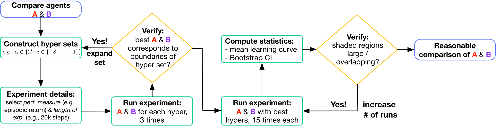
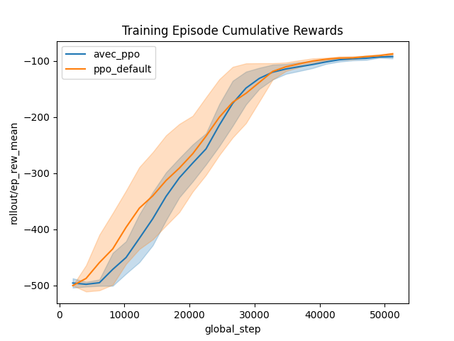
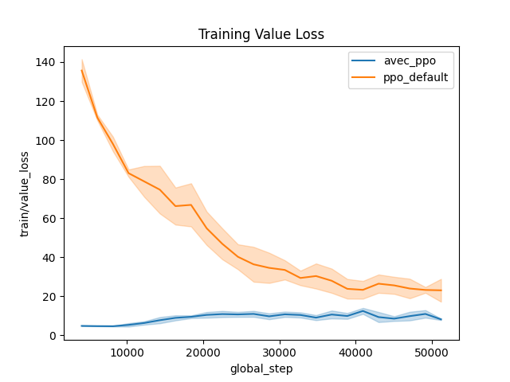
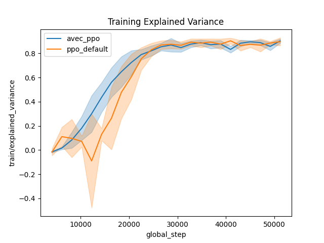
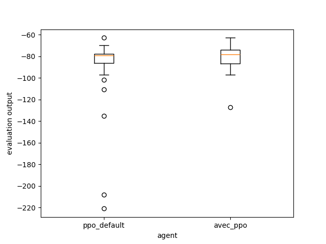

# Overview

In this tutorial we are interested in reproducible reinforcement learning research. The experiments in this repository aim to reproduce some deep reinforcement learning results from the paper [Learning Value Functions in Deep Policy Gradients using Residual Variance](https://arxiv.org/pdf/2010.04440). To do so we use a specific [experimental protocole](https://arxiv.org/abs/2304.01315) and open source libraries that we introduce next.

## Empirical reinforcement learning research.
Reinforcement learning (RL) suffers a lot from a lack of reproducibility. Hidden implementation details, and small number of seeds or different machines, hinders advances in the field. In this [paper](https://arxiv.org/abs/2304.01315), authors recommend an experimental protocole that ensures thorough comparison of agents, say PPO vs SAC. By following such a standardized protocole, RL research can move forward faster and safer: if you claim your agent is new state-of-the-art on some benchmarks, following such protocole could be a validity stamp in your paper! 

### What agent to train?
#### Implementation
We recommend to use the well-maintained, well-documented, and stable, agent implementations from ```stable-baselines3```. We implement [AVEC-PPO](empirical_rl/avec_ppo/avec_ppo.py) from [Learning Value Functions in Deep Policy Gradients using Residual Variance](https://arxiv.org/pdf/2010.04440) by overwriting the ```train()``` method from t[he base PPO agent](https://stable-baselines3.readthedocs.io/en/master/_modules/stable_baselines3/ppo/ppo.html#PPO.train). 
#### Instantiation
One needs to find the best instantiation of each agent to compare. This is done with hyperparameter optimization. For each set of hyperparameters, each agent is trained 3 times. For each agent, the set of hyperparameters giving the best score averaged on runs is kept for the actual comparison. The hyperparameters optimization is done with simple python nested loops [Add link]().
### How to get training data?
We give an overview of the protocole behind the [training code](empirical_rl/training.py)
#### Training and saving
Briefly, ```rlberry``` provides tool to evaluate agents. In particular it handles running multiple seeds of agent instantiations and saves training data. One can do so with the [```ExperimentManager``` class](https://rlberry-py.github.io/rlberry/basics/userguide/experimentManager.html) by feeding it a seed, an agent class, the agent hyperpameters found in the hyperparameters optimization phase, number of training steps and number of runs (This [paper](https://arxiv.org/abs/2304.01315) paper recommends 15 runs but we will see later how to choose the number of runs adaptively to minimize it). 
#### Seeding
Seeding is a key component of reproducible research, beyond RL. By fixing seeds, one can ensure that the stochastic process in the empirical protocole will give the same results, e.g. same neural network weights, same environment starting states and so on. However each machine learning libraries have their own way to do seeding. For example, RL environments from ```gymnasium``` use the seeding from ```numpy``` and actor and critic neural nets from ```stable-baselines3``` use the seeding from ```torch```.[ The seeding of both environements and agents](https://rlberry-py.github.io/rlberry/basics/userguide/seeding.html) is handled automatically by the ```ExperimentManager``` from ```rlberry```!
### How to present and compare training results?
#### Insights
#### Statitiscally significant comparisons.


### Usage
Tested on Python 3.10
```bash
python3 -m venv .venv
source .venv/bin/activate
pip install -r requirements.txt
cd empirical_rl
```

##### Training
```bash
python3 training.py
```
##### Plotting
```bash
python3 plotting.py
```
#### Evaluating
```bash
python3 evaluating.py
```
#### Adastop (long)
```bash
python3 statistical_comparing.py
```


## Expected Results




#### Adastop expected results
```bash
[INFO] 13:10: Test finished 
[INFO] 13:10: Results are  
          Agent1 vs Agent2  mean Agent1  mean Agent2  mean diff decisions
0  default_ppo vs avec_ppo      -86.636    -118.6952    32.0592     equal
```


# TODOs
- Ant-v4
- Loop over hyperparams and expand boundaris (hyperparam optim as per Patterson 2023)
- Docstrings ?
- Fix bug data loading for plotting data.